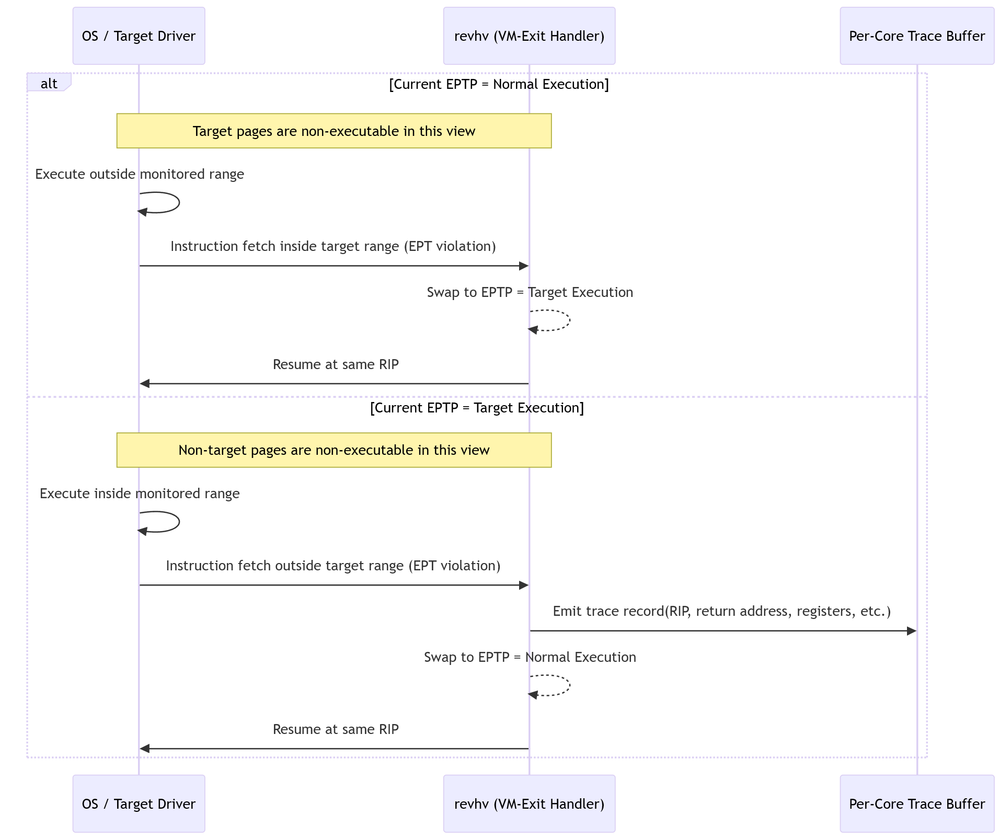

# revhv

revhv is a type-2 Intel x86-64 hypervisor for modern Windows systems built to facilitate dynamic tracing of highly obfuscated or virtualized drivers where static analysis becomes too expensive or too blind.

The tracing model is built around control-flow transitions between a monitored address range and the rest of the system by utilizing EPT. That means revhv can show which kernel APIs or other external code paths an obfuscated target actually reaches at runtime.

The project is intentionally narrow. It is not trying to be a generic instruction tracer or a full introspection framework. The goal is to answer questions like:

- Which kernel APIs does this protected driver actually reach at runtime?
- What arguments/guest state such as registers were present at that boundary?

For a longer walkthrough and a real analysis example, see the write-up: [dynamic analysis with revhv](https://life45.github.io/blog/dynamic-analysis-with-revhv/).

## How tracing works

revhv keeps two EPTP views per vCPU:

- normal execution: *target* pages are non-executable
- target execution: all *non-target* pages are non-executable

Crossing the boundary between those views causes an EPT violation. revhv handles the VM-exit, flips the active EPTP, and resumes at the same RIP. 
A trace record is emitted for `target execution` -> `normal execution` transitions.

<a href="trace_seq_diagram.png">
  
</a>

The same boundary concept can just as easily be used in reverse to uncover hooks or inbound control-flow into a region, although that is not the current implementation focus.

## Typical workflow

1. Start `revhv-um` and verify the hypervisor is present.
2. Use `ln` and `lm` to identify the target module and address range.
3. Configure the generic or exact capture fields you care about.
4. Enable auto-trace for the target range, or arm `at onload` if the driver is not loaded yet.
5. Exercise the target.
6. Disable auto-trace.
7. Parse the trace directory offline.

The following is a partial extracted log from an example run on a heavily virtualized anti-cheat driver, showing part of its unload routine:

<details>
<summary>Example partial logs of the unload routine</summary>

```text
...
[core 8] ntoskrnl!KeAcquireGuardedMutex
[core 8] ntoskrnl!KeReleaseGuardedMutex
[core 8] ntoskrnl!NtClose
[core 8] ntoskrnl!ObfDereferenceObject
[core 8] ntoskrnl!ExFreePoolWithTag
[core 8] ntoskrnl!PsSetCreateProcessNotifyRoutineEx
[core 8] ntoskrnl!PsRemoveCreateThreadNotifyRoutine
[core 8] ntoskrnl!PsRemoveLoadImageNotifyRoutine
[core 8] ntoskrnl!ObUnRegisterCallbacks
...
[core 8] ntoskrnl!SeUnregisterImageVerificationCallback
[core 8] ntoskrnl!CmUnRegisterCallback
...
[core 8] ntoskrnl!KeSetEvent
[core 10] ntoskrnl!KeResetEvent
[core 8] ntoskrnl!KeSetEvent
[core 8] ntoskrnl!KeWaitForSingleObject
[core 10] ntoskrnl!KeAcquireGuardedMutex
[core 10] ntoskrnl!KeReleaseGuardedMutex
[core 10] ntoskrnl!PsTerminateSystemThread
...
```

</details>

## Repository layout

- `revhv-km`: KMDF driver that enters VMX operation, virtualizes each logical processor, manages EPT state, handles VM-exits, exposes hypercalls, and emits logs and trace data.
- `revhv-um`: usermode controller for command dispatch, symbol resolution, module enumeration, trace polling, trace configuration, log draining, and offline trace parsing.
- `common`: shared trace, hypercall, logging, and export formats used by both components.

## Build and environment

- Use a recursive clone because dependencies are included as submodules under the project `external` directories.
- Build the Visual Studio solution `revhv.sln`.
- Only the `x64 Debug` configuration is currently set up.
- `revhv-km` requires the WDK.
- Admin rights are required for symbol resolution in `revhv-um`.
- The current code has been tested on Windows 10 and Windows 11 in VMware nested virtualization VMs, and on Windows 11 bare metal.

`revhv-km` can be loaded through traditional methods when DSE is disabled, or through manual mapping. However, the driver's PE and NT headers are currently used by its memory manager when mapping host page tables. Many manual mappers strip or omit those headers, which can crash the system. If a manual mapper is used, either the mapper or `revhv-km` needs corresponding implementation changes.

## Isolation from the host OS

Although revhv is a type-2 hypervisor, the VMX-root environment is intentionally separated from the host OS as much as possible.

revhv does not share, for VMX-root execution:

- page tables (all levels)
- GDT
- IDT
- stack
- PAT
- EFER

Only the hypervisor image and the pools it allocates are mapped into the host VMX-root address space. NT kernel APIs are not used in VMX-root paths and are not mapped there.

Other choices:

- dedicated ISTs are used for NMI, `#DF`, and `#MC`
- `GSBASE` is set to zero in host state
- `FSBASE` is used as the current `vcpu` pointer

## Trace logging

Trace logging is split into two separate systems:

- Standard logs: formatted messages emitted through `LOG_INFO`, `LOG_ERROR`, and related macros. These go to a synchronized global ring buffer and optionally to serial COM1.
- Trace logs: high-rate binary entries emitted through `hv::trace::emit`. These are per-vCPU, lock-free, and unsynchronized across cores by design.

Both of these logging mechanisms can be used at any IRQL and from vmx-root.

Usermode starts one polling thread per logical processor and drains each per-core ring buffer through hypercalls into `trace_core_N.bin`. When auto-trace starts, the controller also writes:

- `modules.bin`: snapshot of loaded kernel modules at capture start
- `trace_cfg.bin`: exported capture configuration and optional formatting rules

Offline parsing then:

1. loads `modules.bin`
2. loads `trace_cfg.bin` if present
3. opens all `trace_core_N.bin` files
4. performs a timestamp-ordered k-way merge
5. resolves symbols lazily from module images on disk
6. writes a formatted combined log

Offline parsing currently has to be done on the same machine that auto-trace logs were captured on, simply because symbol parsing depends on the full path of the module being accessible.

Future versions of revhv will address this limitation.

## Configurable capture

Trace entries are not hard-coded to a single layout. revhv supports:

- a generic transition configuration applied by default
- exact-address overrides keyed by guest RIP
- optional custom format strings for the offline parser

The default generic configuration captures:

- `rip`
- `retaddr`

Additional fields can be configured per capture point, including:

- `rsp`, `rax`, `rbx`, `rcx`, `rdx`, `rsi`, `rdi`, `rbp`
- `r8` through `r15`
- `retaddr`

Example capture rule:

```text
at config exact nt!NtOpenFile rip retaddr rcx rdx r8 r9
```

Example offline formatting rule:

```text
at config fmt exact nt!ExFreePool "{retaddr} -> {rip}(pool = {rcx:x})"
```

`revhv-km` captures raw data only for performance reasons, `revhv-um` decides how to render it later. It can't render data that has not been captured.

## Exception handling without SEH

`revhv-km` does not rely on SEH in VMX-root mode.

Instead, it uses a small explicit exception catcher:

- `R14` holds the address of an instruction expected to fault.
- `R15` holds the recovery address.
- when selected host exceptions occur, the trap handler checks whether `RIP == R14`
- if so, exception details are saved into the current `vcpu`
- execution resumes at `R15`

This is used for operations where the hypervisor deliberately attempts fault-prone instructions and needs exception handling.

At present, `#UD` and `#GP` are handled this way. Other unexpected host exceptions are treated as fatal.

## Unrecoverable host errors

When the hypervisor encounters an unrecoverable host error, the goal is to stop in a way that preserves diagnostic state and avoids triple-faults or resets.

The raising core does the following:

1. devirtualizes itself
2. switches back to a valid host code segment context
3. marks crash-in-progress atomically
4. sends NMIs to all other logical processors through x2APIC or xAPIC
5. waits for all other cores to acknowledge
6. calls `KeBugCheckEx(MANUALLY_INITIATED_CRASH, 'rvhv', ...)`

Responding cores do the following:

1. take the NMI on a dedicated IST (if executing in vmx-root at the time), or perform a guest NMI VMEXIT (if executing in vmx non-root at the time)
2. detect that crash handling is in progress
3. devirtualize themselves
4. increment the crash acknowledgement count
5. unblock NMIs with a crafted `IRETQ` frame
6. spin with interrupts enabled until the initiating core bugchecks

This behavior ensures a deterministic fail path where Windows can take control of all cores when `KeBugCheckEx` is called, and allows it to capture a crash dump. This dump also contains all regular logs of the hypervisor to provide valuable info for the reason of the crash (This is only the case when full memory dumps are enabled in Windows settings).

A known limitation is when an unrecoverable error happens at early startup stage. This specifically happens when a virtualized core raises an unrecoverable error while all cores have not launched yet. When the raising core sends the NMI, the core that did not launch yet receives the NMI through Windows' IDT. This usually results in a `NMI_HARDWARE_FAILURE` bugcheck, as Windows is not expecting an NMI at that time.

## Stealth and timing behavior

revhv's stealth implementation for timing checks is currently simple but enough for most uses.

Current measures include:

- VM-exit MSR-store and VM-entry MSR-load handling for `IA32_MPERF`, `IA32_APERF`, and `IA32_TIME_STAMP_COUNTER`
- VMCS handling for `IA32_PERF_GLOBAL_CTRL`
- TSC offset compensation to counter VM-exit and VM-entry overhead
- VMX preemption timer based resynchronization to limit cross-core TSC drift

`IA32_TIME_STAMP_COUNTER` is saved on VM-exit but not loaded on VM-entry. Instead, revhv measures the relevant overhead and adjusts the VMCS TSC offset before `VMRESUME`.

The core idea is:

```text
desired_tsc = stored_tsc + native_instruction_overhead - vmentry_overhead - vmexit_to_store_overhead
tsc_offset -= (rdtsc() - desired_tsc)
```

The benchmark path runs through a fast assembly path in the VM-exit stub so the C++ handler does not contaminate the measurement more than necessary.

Because invariant TSC still becomes desynchronized once each core is being adjusted independently, revhv periodically resynchronizes through the VMX preemption timer. Without that, Windows behavior becomes erratic.

A known limitation for `PMCs` and `MPERF/APERF` is the overhead of internal operations performed by the CPU itself until saving these MSRs on VMEXIT, and between loading them back on VMRESUME - landing on the next guest instruction boundary. This is handled by the benchmarking method and the provided formula for `TSC`, and it could theoretically be applied for others as well.

## Usermode controller

`revhv-um` provides most of the workflow around the hypervisor:

- detects whether the hypervisor is present on all cores
- resolves symbols and addresses
- enumerates loaded kernel modules even when the hypervisor is absent
- reads kernel memory through hypercalls when the hypervisor is active
- drains standard hypervisor logs into a local file
- controls auto-trace enable and disable
- snapshots module state and trace configuration when a trace starts
- drains per-core trace buffers into binary files
- parses raw traces offline with symbol resolution and custom formatting

A practical consequence is that some commands remain useful without VMX at all. Offline and symbol-oriented commands still work when the hypervisor is not present.

## Commands

Some commands are intentionally in *WinDbg fashion* for familiarity.

<details>
<summary>General</summary>

- `help` or `?`
  - Show the general command list.

- `q`, `quit`, `exit`
  - Exit the controller.

</details>

<details>
<summary>Symbol and module workflows</summary>

- `ln <address|symbol>`
  - Resolve an address to the nearest symbol, or a symbol expression to an address.
  - Supported forms include `module`, `module+offset`, `module!symbol+offset`, and `module:section+offset`.
  - Examples:

```text
ln nt!MmCopyMemory+0x100
ln nt:PAGE+0x123
ln 0xfffff80312345678
```

- `lm [filter]`
  - List loaded kernel modules.
  - Works even without the hypervisor.
  - Examples:

```text
lm
lm nt
```

- `lm export <filename>`
  - Export the current module list for offline use.
  - Example:

```text
lm export modules.bin
```

</details>

<details>
<summary>Memory inspection</summary>

- `db`, `dw`, `dd`, `dq`, `dp`
  - Dump guest virtual memory through hypercalls.
  - `db`: bytes
  - `dw`: words
  - `dd`: dwords
  - `dq`: qwords
  - `dp`: pointers, with symbol resolution for pointed-to addresses
  - Forms:

```text
db <address|symbol> [count] [target_cr3]
dw <address|symbol> [count] [target_cr3]
dd <address|symbol> [count] [target_cr3]
dq <address|symbol> [count] [target_cr3]
dp <address|symbol> [count] [target_cr3]
```

Examples:

```text
db nt!MmCopyMemory 40
dd fffff80312340000 20
dp ntoskrnl!KeBugCheckEx+20 8
dq nt:PAGE+123
```

</details>

<details>
<summary>Auto-trace</summary>

- `at enable <address|symbol> <size> [output_dir]`
  - Enable auto-trace for an address range.
  - Starts per-core trace polling threads.
  - Saves `modules.bin` and `trace_cfg.bin` into the output directory.
  - Examples:

```text
at enable nt!NtCreateFile 20
at enable fffff80312345678 100 C:\traces
```

- `at disable`
  - Stop polling, flush remaining entries, and restore normal EPT state.
  - Example:

```text
at disable
```

- `at onload <driver_name> [output_dir]`
  - Arm auto-trace to fire automatically the moment a specific driver is loaded by the system.
  - `driver_name` is the driver basename, including extension, and is matched case-insensitively (e.g. `Dbgv.sys`).
  - The trace poller is started immediately; tracing begins once the driver loads.
  - `trace_cfg.bin` is saved right away. `modules.bin` is saved lazily: the controller waits for the first non-empty trace batch (indicating the driver is executing), then polls the module list until the target driver appears, and only then exports `modules.bin` so that the target is guaranteed to be present in the snapshot.
  - Issuing `at onload` again overwrites any existing target.
  - Example:

```text
at onload Dbgv.sys
```

- `at onload clear`
  - Disarm the pending onload target and stop the trace poller.

- `at config generic <f0> [f1] [f2] [f3] [f4] [f5]`
  - Set the default field map used for transition captures.
  - Example:

```text
at config generic rip retaddr
```

- `at config exact <address|symbol> <f0> [f1] [f2] [f3] [f4] [f5]`
  - Override the capture map for one exact guest RIP.
  - Example:

```text
at config exact nt!NtOpenFile rip retaddr rcx rdx r8 r9
```

- `at config fmt generic "<format>"`
  - Set the default output format for offline trace parsing.
  - Example:

```text
at config fmt generic "{rip} {retaddr}"
```

- `at config fmt exact <address|symbol> "<format>"`
  - Set a per-address formatting rule.
  - Example:

```text
at config fmt exact nt!ExFreePool "{retaddr} -> {rip}(pool = {rcx:x})"
```

- `at config fmt clear generic`
- `at config fmt clear exact <address|symbol>`
  - Remove previously configured formatting rules.
  - Example:

```text
at config fmt clear exact nt!ExFreePool
```

- `at config export <path>`
  - Write the current configuration to disk for offline parsing.
  - Example:

```text
at config export trace_cfg.bin
```

</details>

<details>
<summary>Offline trace parsing</summary>

- `trace parse <modules.bin> <trace_dir> [output_file]`
  - Parse all `trace_core_N.bin` files in a directory.
  - Merge them by timestamp.
  - Resolve symbols from module files on disk.
  - Apply exported formatting rules.
  - Does not require the hypervisor.
  - Examples:

```text
trace parse modules.bin .\traces
trace parse modules.bin .\traces combined.log
```

</details>

<details>
<summary>Miscellaneous</summary>

- `apic`
  - Query APIC information through the hypervisor.

- `df`
  - Deliberately trigger a host double fault path for testing.
  - This is expected to crash the system, but not freeze it. The goal is to test ISTs and the unrecoverable error mechanism.

</details>

## Acknowledgements

The idea of making an Intel hypervisor from scratch was inspired by [jonomango/hv](https://github.com/jonomango/hv).
